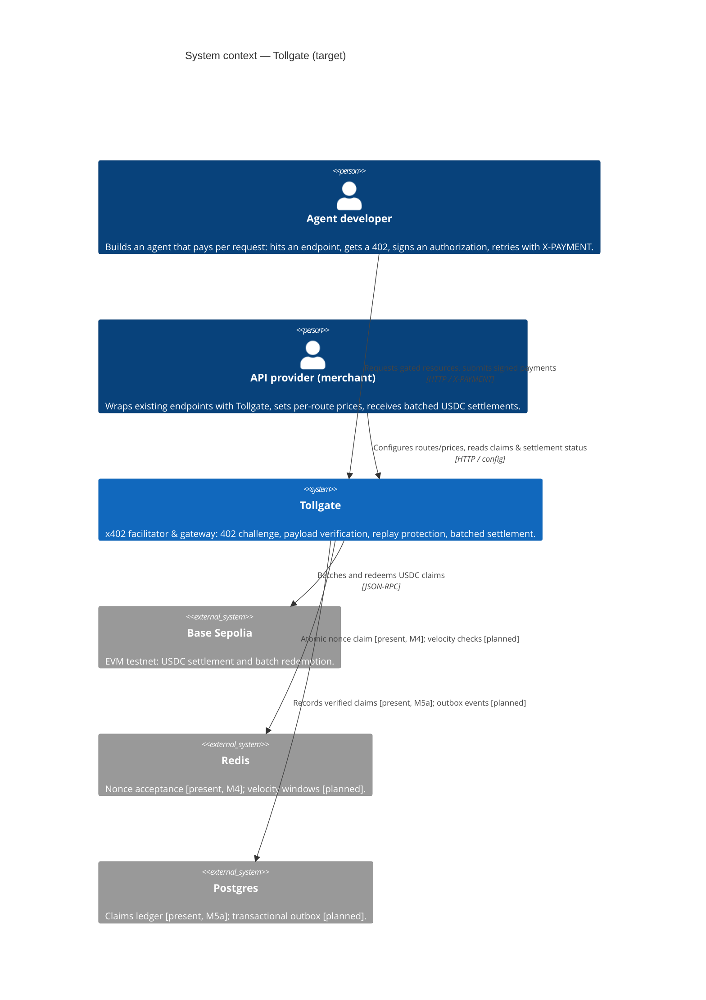
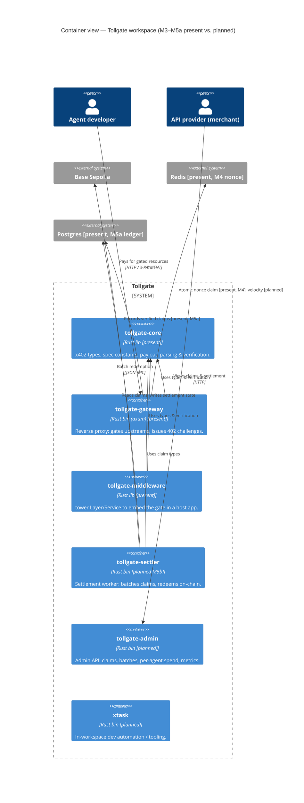

# Architecture

Tollgate is an [x402](https://www.x402.org/) payments facilitator and gateway: it
gates HTTP endpoints behind a machine-readable 402 challenge, verifies signed
payment authorizations, protects against replay, and settles batched USDC claims
on Base Sepolia. These C4 diagrams describe the **target** system; only the parts
marked *present* exist today. As of **M3**, `tollgate-core`,
`tollgate-middleware`, and `tollgate-gateway` are built (offline verification, the
tower gate, and the axum reverse proxy); the **M4 nonce-store slice** then made
**Redis** a real backend — the gate claims nonces atomically against Redis for
replay protection — and the **M5a claims-ledger slice** made **Postgres** one too:
every accepted payment is recorded durably in the claims ledger. The rest of M4
(the policy engine: per-payer velocity and spend caps), settlement (M5b), and
everything downstream remain planned containers that later milestones (M4–M7)
will fill in.

The diagrams below render natively on GitHub via `mermaid` code fences — no build
step required.

## System context

The context diagram shows who uses Tollgate and the external systems it depends
on. Two human/agent actors drive it: an **API provider (merchant)** wraps their
endpoints and receives settlements, and an **Agent developer** whose agent pays
per request. Tollgate itself is a single system boundary here; it settles on
**Base Sepolia**, claims replay-protection state from **Redis**, and persists the
claims ledger in **Postgres**. The **Redis nonce-claim** (M4) and **Postgres
claims-ledger** (M5a) integrations are wired — the gate claims nonces atomically
and records every accepted claim; velocity windows, the outbox, and Base Sepolia
settlement remain the shape the later milestones build toward.

## Container view

The container diagram breaks Tollgate into its Cargo workspace crates. As of M3,
**`tollgate-core`** (library), **`tollgate-middleware`** (library), and
**`tollgate-gateway`** (binary) are built and marked *[present]*; the remaining
containers are *[planned]* and shown as boxes only — no internal detail is
invented for unbuilt crates. The label on each container carries its
present/planned marker, and the legend restates the convention.

**Legend.** `[present]` = shipped (M0–M3, plus the M4 Redis nonce-claim and M5a
claims-ledger slices).
`[planned M<n>]` = scheduled for that
milestone (see the [Roadmap](../README.md#roadmap)); `[planned]` with no number is
scheduled but unscoped. Planned containers are placeholders — their internals are
defined when their milestone lands.
